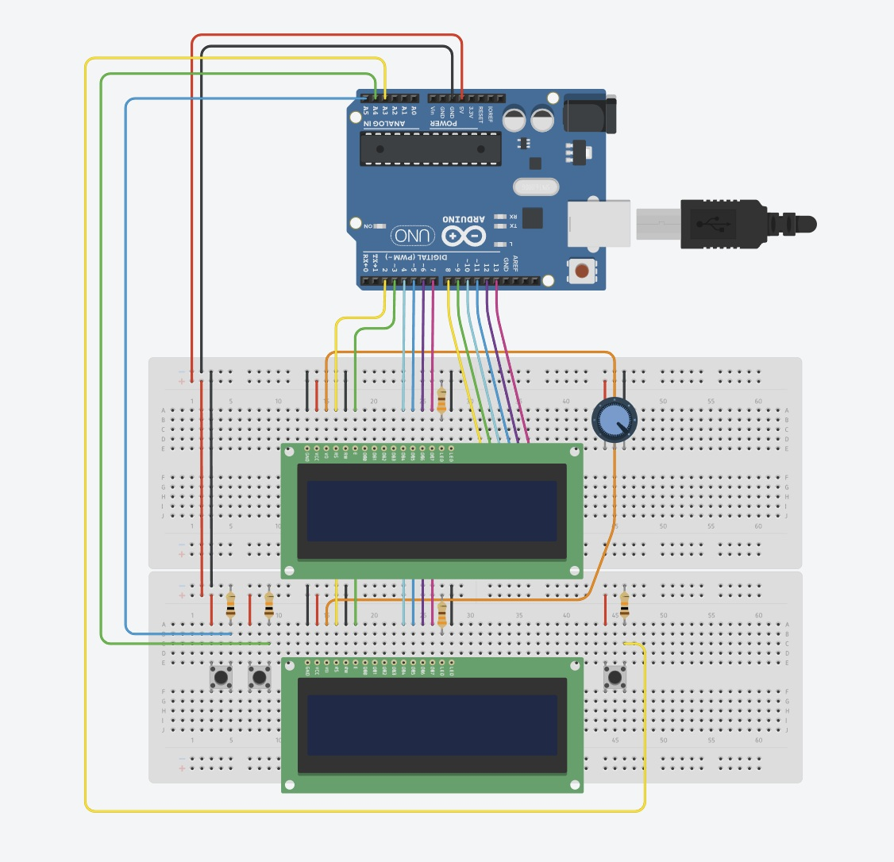

# 🚀 Space Invaders com Arduino

Este projeto é uma recriação do clássico **Space Invaders**, desenvolvida em **Arduino**, utilizando **dois displays LCD 16x2** para exibir o jogo. O projeto foi inicialmente criado no **Tinkercad** e posteriormente montado fisicamente com melhorias de hardware e efeitos sonoros.

---

## 🧠 Sobre o Projeto

O objetivo deste projeto foi criar uma versão simplificada do jogo **Space Invaders** utilizando componentes eletrônicos básicos e programação em C++ no Arduino.  
O jogo é controlado por botões e exibe a movimentação dos inimigos e do jogador nos dois displays LCD.

### 📘 Projeto Original no Tinkercad
- Desenvolvido com **Arduino UNO**  
- Utiliza **2 displays LCD 16x2 (sem módulo I2C)**  
- Sem **buzzer** ou **efeitos sonoros** devido à limitação de pinos  

### 💾 Código Final do Projeto (Versão Real)
- Adaptado para **Arduino Mega**  
- Inclui **buzzer** com **efeitos sonoros**  
- Pequenas alterações no código para compatibilidade com o novo hardware  

> 📝 **Observação:**  
> O projeto foi inicialmente criado no **Tinkercad** usando um **Arduino UNO**, que possui uma quantidade limitada de pinos.  
> Ao montar o circuito físico, utilizei o **Arduino Mega**, que oferece mais pinos e permitiu adicionar um **buzzer** e **efeitos sonoros extras**.  
> Por esse motivo, o código final usado no Mega possui algumas pequenas diferenças em relação ao projeto original.

---

## 🔧 Componentes Utilizados

| Quantidade | Componente | Observações |
|-------------|-------------|--------------|
| 1 | Arduino UNO / MEGA | UNO no projeto original, MEGA na versão final |
| 2 | Display LCD 16x2 | Sem módulo I2C |
| 1 | Potenciômetro | Controle de contraste do LCD |
| 3 | Botões | Controle do jogo |
| 1 | Buzzer | Efeitos sonoros |
| 3 | Resistores 10k Ω | Pull-down dos botões |
| 2 | Resistores 330 Ω | Limitação de corrente dos displays |
| Vários | Jumpers | Ligações gerais do circuito |

---

## 🖼️ Imagem do Circuito Montado

  

---

## 🔗 Links Importantes

- 🎮 **Projeto Original no Tinkercad:** [Clique aqui para acessar](https://www.tinkercad.com/things/6FMz1oGX6Bg-projeto-space-invaders-com-2-lcd-sem-efeitos-sonoros?sharecode=ApZ3dIfrCQZAPIDOOKYbFAd2AP10fWAGJ_BXco7bwzo)  
- 📹 **Vídeo de Demonstração no YouTube:**

- 

---

## 💡 Créditos

Desenvolvido por **Eduardo Brandão Silva**  
Inspirado no clássico **Space Invaders (1978)**  
